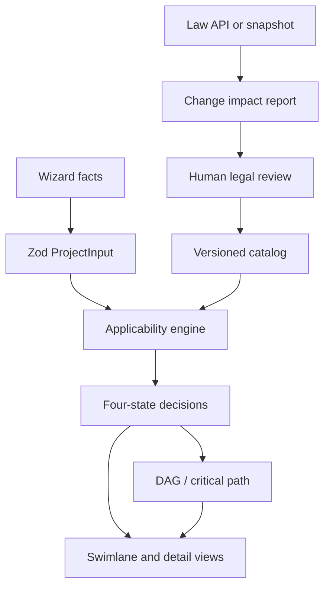

# Architecture

## System flow

The law API never rewrites production rules. It provides normalization and evidence-change signals for a reviewed catalog update.

## Boundaries

### Browser

`DashboardClient` stores non-sensitive scenario answers, evaluates the local versioned catalog, and serializes an allowlisted state into the URL. Addresses, documents and API secrets are excluded. The UI is entirely DOM-based, including the swimlane and partial Gantt view.

### Domain and data

`lib/domain/schemas.ts` is the contract for facts, procedures, rule AST, citations, sources, durations and edges. `lib/data/catalog.ts` parses all JSON and rejects duplicate IDs, dangling references and catalog cycles during import/build.

### Decision engine

`lib/engine/rule-engine.ts` recursively evaluates declarative conditions using three-valued internal truth (`TRUE`, `FALSE`, `UNKNOWN`). It resolves rule effects and priorities into four user-facing statuses and preserves a trace of used inputs, missing inputs, passed/failed conditions, citations and conflicts.

### Schedule engine

`lib/engine/schedule.ts` selects applicable/optional procedures, filters legal and optionally practical edges, topologically sorts them, and calculates earliest/latest times and slack for minimum/base/maximum duration scenarios. Unknown duration remains `null`; a zero is used only internally to expose a clearly labeled partial lower-bound calculation.

### Law API boundary

`lib/law-api/client.server.ts` is server-only. It uses a fixed HTTPS origin, target allowlist, encoded parameters, response-size limit, timeout, bounded retry, pagination cap, rate limit and in-memory cache. Missing credentials or failure returns the reviewed snapshot with warnings.

## Deployment

- Vercel: `next build` through `npm run vercel-build`; `LAW_API_OC` is a server environment secret.
- The application is stateless. No D1 or R2 binding is required for the current deployment.
- Snapshot and catalog changes are Git-reviewed artifacts.

## Failure modes

| Failure | Safe behavior |
|---|---|
| Missing `LAW_API_OC` | Snapshot mode with visible warning |
| HTTP 200 error object / invalid root | Reject payload, use snapshot |
| Timeout / 429 / 5xx | Bounded retry, then snapshot |
| Missing project fact | `NEEDS_MORE_INFO` |
| Unverified matched procedure | `POSSIBLY_APPLIES` |
| Missing duration | `null`, partial-schedule warning |
| Catalog reference/cycle error | Import/build/test failure |
